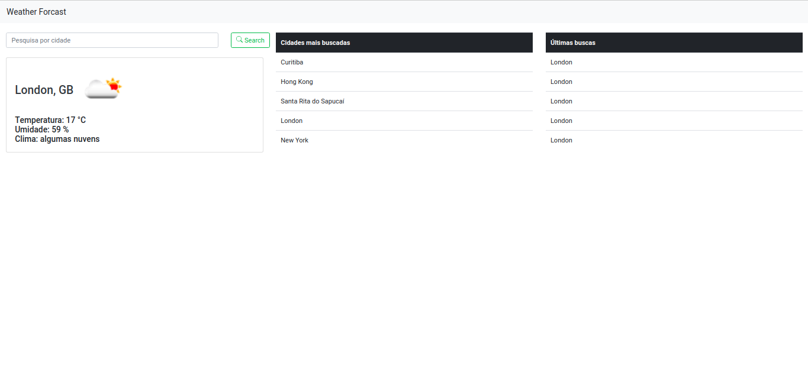
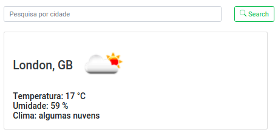

# weather-forecast

## Instalando Recursos do Projeto

Para que o proejto seja inicializado corretamento, siga os passo a passo abaixo:

[Instalar o NodeJS](https://nodejs.org/pt-br/download/package-manager/)

[Instalando o Banco de dados](./docs/MONGO.md)

[Iniciando o projeto](./docs/PROJECT_INIT.md)

## Desmonstração do Sistema

