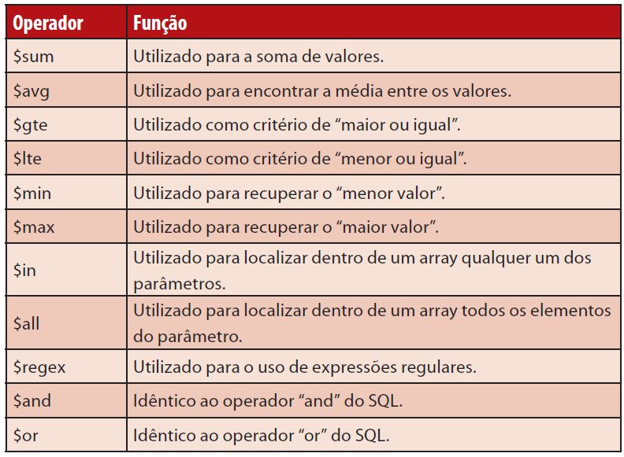

## Comandos para o Mongo DB 

[Voltar](./../README.md)

**É necessário estar dentro do banco*

Para instalar o Mongo DB use este tutorial:

[Instalar e configura o mongo DB](https://imasters.com.br/banco-de-dados/mongodb-para-iniciantes-em-nosql)

Mostar as bases de dados e seus tamanhos:

    show dbs

Criar uma base de dados:

    use <<Nome_da_base_de_dados>>

Inserindo dodos na base *:

    db.collection.save({<JSON com os dados>})

Apagar o banco de dados *:

    db.dropDatabase()

Criando uma Coleção *:

    db.createCollection("<Name_Collection>")

Saber a realação de collection de dentro do banco *: 

    db.getCollectionNames()

Apagar uma collection *:

    db.collection.drop()

Realizar a busca do ultimo documento salvo *:

    db.collection.findOne()

Realizar a busca de todos os documento em uma collection *:

    db.collection.find().pretty()

Realizando buscas na base de dados:

    db.collection.find({chave: {operation: value}})

Opeardores de comparação (chave) do Mongo DB:

Realizar update:

    db.collection.update()(
        {paramentros para atualização},
        {campo que vão sofrer alterações},
        {condição de atualização para o primeiro ou pra todos}
    )   

    db.collection.update(
    <query>,
    <update>,
    {
        upsert: <boolean>,
        multi: <boolean>,
        writeConcern: <document>,
        collation: <document>,
        arrayFilters: [ <filterdocument1>, ... ],
        hint:  <document|string>        // Available starting in MongoDB 4.2
    }
    )

Para ver dados do banco em modo gráfico:

    Acesse: http://127.0.0.1:27017/

### Links Extras:

[Documentação Official](https://docs.mongodb.com/manual/introduction/)

[MongoDB: como relacionar dados](https://medium.com/@thaisdalencar/mongodb-como-relacionar-dados-3e6e8f136590)

